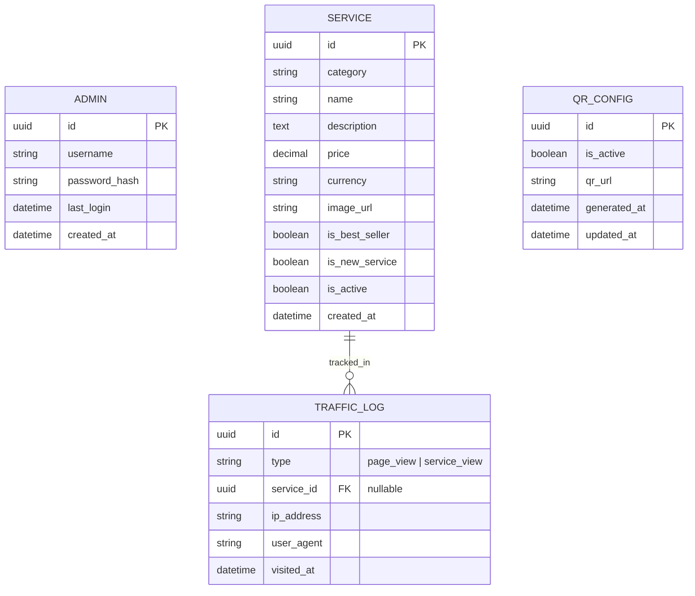

# Database Schema Spec: QR-Home Generation System

Dưới đây là thiết kế Schema cơ sở dữ liệu dựa trên Business Specification của hệ thống QR-Home Generation.

## 1. Biểu đồ quan hệ thực thể (ERD)

---

## 2. Chi tiết các bảng (Tables)

### 2.1 Table: `admins`

Lưu trữ thông tin quản trị viên đăng nhập vào trang Admin.

| Column          | Type     | Constraints                    | Description             |
| :-------------- | :------- | :----------------------------- | :---------------------- | --- |
| `id`            | UUID     | PK, Default: gen_random_uuid() | ID duy nhất của admin   |
| `username`      | String   | Unique, Not Null               | Tên đăng nhập           |
| `password_hash` | String   | Not Null                       | Mật khẩu đã mã hóa      |
| `created_at`    | DateTime | Default: NOW()                 | Thời gian tạo tài khoản |     |

### 2.2 Table: `services`

Bảng trung tâm lưu trữ thông tin các dịch vụ Spa.

| Column           | Type     | Constraints    | Description                  |
| :--------------- | :------- | :------------- | :--------------------------- | --- |
| `id`             | UUID     | PK             | ID dịch vụ                   |
| `category`       | String   | Not Null       | Danh mục dịch vụ             |
| `name`           | String   | Not Null       | Tên dịch vụ                  |
| `description`    | Text     | Not Null       | Mô tả chi tiết dịch vụ       |
| `price`          | Decimal  | Not Null       | Giá dịch vụ (theo USD)       |
| `duration`       | Integer  | Not Null       | Thời gian thực hiện (phút)   |
| `currency`       | String   | Default: 'USD' | Đơn vị tiền tệ               |
| `image_url`      | String   | Not Null       | Link ảnh minh họa            |
| `is_best_seller` | Boolean  | Default: false | Gắn nhãn Best Seller         |
| `is_new_service` | Boolean  | Default: false | Gắn nhãn New Service         |     |
| `is_active`      | Boolean  | Default: true  | Trạng thái (Active/Inactive) |
| `created_at`     | DateTime | Default: NOW() | Thời gian tạo                |
| `updated_at`     | DateTime | Default: null  | Thời gian cập nhật           |

### 2.3 Table: `qr_config`

Quản lý cấu hình mã QR của hệ thống.

| Column         | Type     | Constraints    | Description                        |
| :------------- | :------- | :------------- | :--------------------------------- |
| `id`           | UUID     | PK             | ID config                          |
| `is_active`    | Boolean  | Default: false | Trạng thái hoạt động của QR        |
| `qr_url`       | String   | Nullable       | Link dẫn đến trang menu khách hàng |
| `generated_at` | DateTime | Default: null  | Thời gian gen mã QR                |
| `updated_at`   | DateTime | Default: null  | Thời gian cập nhật trạng thái      |

### 2.4 Table: `traffic_logs`

Lưu trữ dữ liệu truy cập để hiển thị biểu đồ 7 ngày và thống kê "Dịch vụ xem nhiều nhất".

| Column       | Type     | Constraints                   | Description                                                                 |
| :----------- | :------- | :---------------------------- | :-------------------------------------------------------------------------- |
| `id`         | UUID     | PK                            | ID bản ghi log                                                              |
| `type`       | Enum     | page_view, service_view       | 'page_view': Truy cập trang chủ Menu / 'service_view': Xem chi tiết dịch vụ |
| `service_id` | UUID     | FK -> `services.id`, Nullable | ID dịch vụ được xem (chỉ có khi type = 'service_view')                      |
| `ip_address` | String   | Nullable                      | IP khách truy cập (để lọc bot/spam)                                         |
| `user_agent` | String   | Nullable                      | Thông tin thiết bị (Mobile/Desktop)                                         |
| `visited_at` | DateTime | Default: NOW()                | Thời gian truy cập                                                          |

---

## 3. Logic Nghiệp vụ Phụ thuộc (Constraints & Triggers)

1.  **QR Generation Rule:**
    - Không cho phép chuyển `qr_config.is_active` sang `true` nếu bảng `services` không có ít nhất 1 bản ghi ở trạng thái `is_active = true`.
2.  **Top Viewed Logic (Article Slide):**
    - "Article Slide" mặc định sẽ lấy Top 5 `service_id` có số lượng bản ghi trong `traffic_logs` nhiều nhất trong 30 ngày gần nhất tức là trong 1 tháng (trừ khi được cấu hình thủ công). Hết tháng thì cũng reset lại day.
3.  **Growth Calculation (Tăng trưởng lượt xem dịch vụ):**
    - Logic frontend/backend:
      - `YesterdayViews = COUNT(traffic_logs) WHERE type = 'service_view' AND DATE(visited_at) = CURRENT_DATE - 1`
      - `TodayViews = COUNT(traffic_logs) WHERE type = 'service_view' AND DATE(visited_at) = CURRENT_DATE`
      - `Growth % = ((TodayViews - YesterdayViews) / YesterdayViews) * 100` (Nếu tăng hiển thị xanh, giảm đỏ).
4.  **Dashboard Traffic View (Biểu đồ 7 ngày):**
    - `TotalPageViews = COUNT(traffic_logs) WHERE type = 'page_view' GROUP BY DATE(visited_at) AS date_point`.
5.  **Pagination & Filter:**
    - API hỗ trợ `limit=20` mặc định cho danh sách dịch vụ.
    - Hỗ trợ query filter theo `category_id`, `name` (search), và `is_active` (status).
